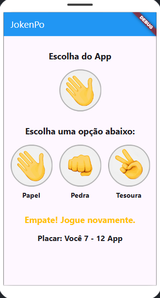
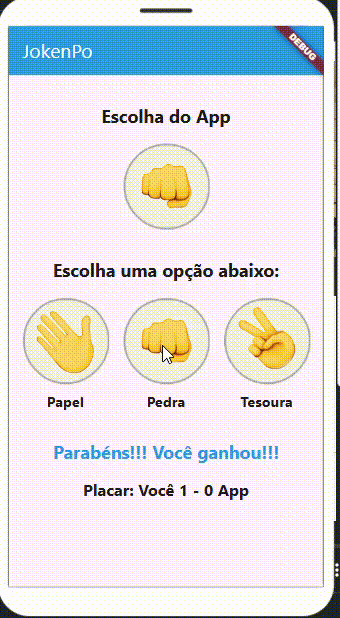

# JokenPo - Flutter

Este é um jogo de Pedra, Papel e Tesoura desenvolvido em Flutter. O aplicativo permite ao usuário jogar contra a máquina, exibindo o resultado da partida e mantendo um placar atualizado.

## 📌 Funcionalidades
- Escolha entre Pedra, Papel ou Tesoura.
- O aplicativo gera automaticamente uma jogada aleatória.
- Exibição do resultado da partida.
- Contagem de pontos para o usuário e para o aplicativo.
- Cores indicativas para vitória (azul), derrota (vermelho) e empate (amarelo).
- Interface amigável e responsiva.

## 🖥️ Captura de Tela


## 🎥 Demonstração


## 📂 Como Executar
1. Clone este repositório:
   ```bash
   git clone https://github.com/seu-usuario/jokenpo-flutter.git
   ```
2. Acesse a pasta do projeto:
    ```bash
    cd jokenpo-flutter
    ```
3. Instale as dependências:
   ```bash
   flutter pub get
   ```
4. Execute o projeto:
   ```bash
   flutter run
   ```

## 🚀 Tecnologia Utilizada
- Flutter (Dart)
---

## 👨‍🎓 Desenvolvido por

**Caio Taveira - 23947**
